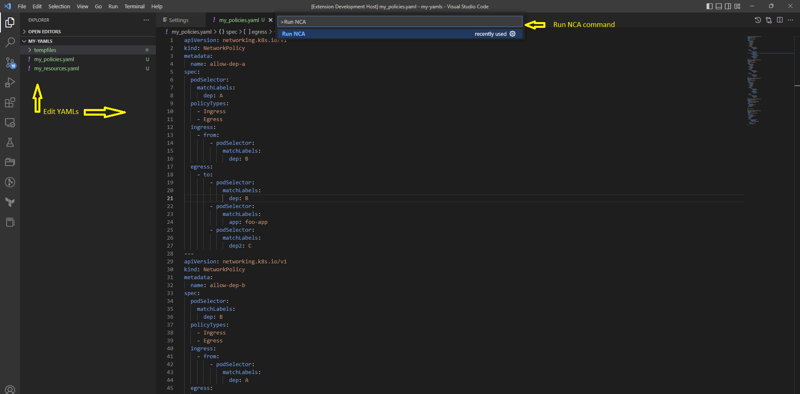
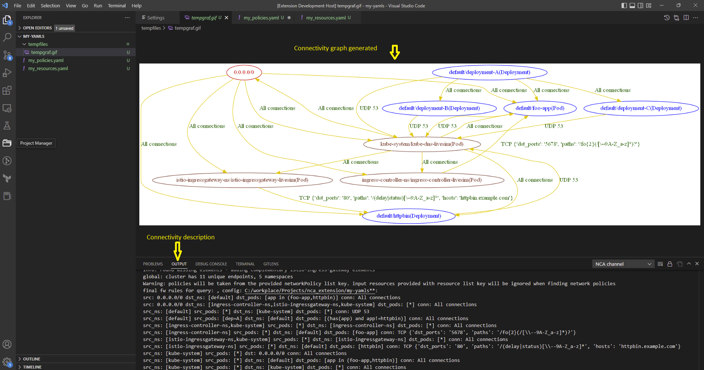

# NCA README

With this extension you can use the Network Config Analyzer (NCA) tool directly in your VSCode enviroment.

NCA is all about simplifying the process of managing synthesized connectivity. 

With NCA, you can easily visualize your synthesized connectivity as a set of firewall rules, 

making it simple to understand and manage your network configuration.

NCA also makes it easy to produce a connectivity diff between two network configurations, 

helping you to quickly identify any changes and ensure that your network is always up-to-date.

With NCA, you can easily input your network policies and a list of relevant endpoints, 

and get answers to critical questions like:

* What is my current connectivity posture?

* How is my connectivity posture changing?

* Is specific traffic allowed/denied?

* What are the endpoints that are not covered by any policy?

* Are my policies implemented efficiently?

NCA makes it easy to get the insights you need to manage your network more effectively, 
giving you a clear picture of your current state and how it's evolving.

[Learn more about NCA here](https://pypi.org/project/network-config-analyzer/)

# Features
Edit YAMLs inside the VSCODE enviroment and run NCA

Observe the connectivity both via graph and text description 

# Requirements

To use this extension you will need:

Python: [Python instalation](https://www.python.org/downloads/) 

NCA: [NCA instalation](https://pypi.org/project/network-config-analyzer/)
Add the NCA path to the system's path enviromant parameter  

Graphviz: [Graphviz installation](https://graphviz.org/download/)

# Extension Settings

This extension contributes the following settings:

* `nca.NCA Location`: The path to the NCAinstallation.
* `nca.Python Path`: The path to the Python installation.
* `nca.YAML files path`: Path to YAML files (empty will use the current project directory).
* `nca.Parameters`: NCA Command Line Parameters.
* `nca.Output Format`: Format of the connectivity output (output_format).
* `nca.Output File`: Output file path (file_out).
* `nca.Graph File`: Graph file path (jpg file).

# 1.0.0

Initial release of the NCA extension

# Getting Started

1. Open the root folder of your YAML files in VSCode.
2. Configure the NCA and Python paths
3. Activate the 'Run NCA' command (shift-ctrl-p for the list of commands) 
---
